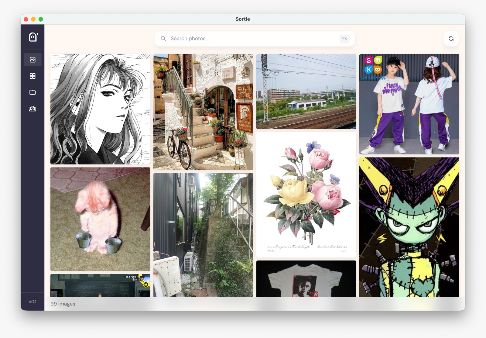

<p align="center">
  
</p>

# Sortie - your local-first pinboard ദ്ദി(˵ •̀ ᴗ - ˵ ) ✧

Sortie is a private image gallery that doesn't compromise on cool features. 

Point it to your photos folder and it builds a gallery you can search, filters, and organise into boards/tags.
Everything stays on your machine.

Available for Windows, macOS and Linux.

## What's in it

<p align="center">

</p>

A local and private embeddings model scans your images and allows you to search your gallery in natural language: type what you remember ("beach at sunset", "red coat") and it finds the image you were thinking about.

Pin your images to Pinterest-style boards, and get smart suggestion for other images to add!

How about family pictures? Sortie runs on-device face detection to allow you to filter your pictures by people.

<p align="center">

</p>

You can also edit and view your image metadatas, adding descriptions, links, favorite them... and jump between related images to surf your gallery!

On top of this, the gallery is optimized to handle thousands and gigabits of images without breaking a sweat! 

ᕙ(  •̀ ᗜ •́  )ᕗ 


## Install

Grab a build from the [Releases page](https://github.com/nathanguilhot/sortie/releases).

**macOS.** Open the `.dmg`, drag to Applications. The build is unsigned, so Gatekeeper will say the app is *damaged*. Clear the quarantine flag once and you're set:

```sh
xattr -cr /Applications/Sortie.app
```

**Windows.** Run `Sortie-Setup-<ver>.exe`. SmartScreen will complain; click **More info** → **Run anyway**.

**Linux.** `chmod +x Sortie-*.AppImage && ./Sortie-*.AppImage`, or install the `.deb`.

## Develop

Node 18 or newer, and Yarn.

```sh
yarn install
yarn dev            # build workspaces + launch Electron with hot reload
yarn dist:mac       # or dist:win / dist:linux — artifacts land in electron/out/
```

See [`docs/RELEASE.md`](docs/RELEASE.md) for versioning, cross-building, and the smoke-test checklist.

## Layout

```
shared/     TypeScript types shared across workspaces
pipeline/   CLIP + face embedding pipeline
electron/   Main process, IPC, React renderer, packaging
docs/       Release guide
```

## License

MIT © Nathan Guilhot
